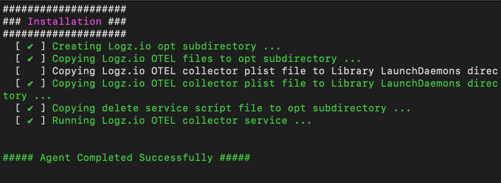

# Logz.io CSE Candidate Assignment – Danielle Gutierrez

This project demonstrates deploying a containerized Flask application on Kubernetes (Minikube), shipping logs into Logz.io, creating alerts, and visualizing results with a dashboard.

---

## 1. Sign-Up & Setup
- Signed up for a **free trial** on Logz.io using temp mail (per instructions).  
- Verified account and logged into the Logz.io console.  


---

## 2. Tokens
- Grabbed initial **data shipping token** via installation instructions.  
- Created an **API token** (“test alert”) later to work with the Alerts API.
  
 

  

---

## 3. Local Tooling (MacOS)
Installed prerequisites:  
- Homebrew  
- Docker Desktop  
- kubectl  
- Minikube  
- Helm  

### Bash Issue
- macOS ships with Bash 3.2; Logz.io requires ≥4.0.  
- Installed Bash 5+ via Homebrew:  
  ```bash
  brew install bash
  /usr/local/opt/bash/bin/bash --version
   ```
  
- Used the new path to run the Logz.io agent installer.

- Result: “Agent completed successfully.” Logz.io UI updated to show Receiving Data.

  
  
  

## 4. Flask Application

Built a minimal Flask service:

- GET / → Hello World

- GET /?name=Danielle → Hello "Danielle"

- GET /healthz → {"status":"ok"}

Each request logs one JSON line (method, path, status, and candidate.name if present) to stdout for ingestion by Logz.io.

## 5. Containerization

- Created requirements.txt and Dockerfile (Python 3.11-slim, port 8080).

- Built and pushed image to Docker Hub:
 ```bash
docker build -t daniellegutierrez/hello-app:v2 .
docker push daniellegutierrez/hello-app:v2
```

## 6. Kubernetes Deployment

- Wrote deployment.yaml (1 replica, readiness probe on /healthz).

- Wrote service.yaml (NodePort 30080).

- Started Minikube with Docker driver (--memory=3000).

- Applied manifests, pod reached READY 1/1.

Validated via Minikube:
 ```bash
minikube service hello-app --url
curl http://127.0.0.1:8080
```

  


## 7. Logs in Logz.io

- Installed Logz.io Helm chart to ship cluster logs.

- Called app endpoints repeatedly (/?name=Danielle).

- Verified logs appeared in Discover:
 ```bash
service.name:"hello-app" AND candidate.name:"Danielle"
```


## 8. Alerting

- Created alert “Danielle >5 in 5m” with Medium severity.

- Grouped by pod name for context; output as a table (timestamp, message, pod).
  


## Triggering

- Ran a loop to generate >5 hits in 5 minutes.

- Alert fired 


## API Update

- Used API GET to pull alert JSON (threshold=5).

- Edited file → changed to threshold=50.

- Used PUT to update alert via API.

- Confirmed update with a second GET.

## 9. Dashboard

Built a 2-panel dashboard:

Panel A: Log Count Over Time

- Line chart: Danielle logs over time.

Panel B: Pod Status Proxy

- Trial dataset lacked Kubernetes pod fields.

- Used _logzio_pattern as a proxy to group logs by structure → shows relative system activity.

- In production, would use the Logz.io K8s agent to ingest pod phases (Running/CrashLoop/etc.).
  
  

## 10. Project Summary

- Deployed a containerized Flask app to Kubernetes.

- Shipped logs into Logz.io and verified ingestion.

- Built an alert + tested it via traffic generation.

- Updated the alert threshold using the API.

- Built a dashboard with two panels (traffic + proxy pod status).

- Deployed a containerized Flask app to Kubernetes.

- Shipped logs into Logz.io and verified ingestion.

- Built an alert + tested it via traffic generation.

- Updated the alert threshold using the API.

- Built a dashboard with two panels (traffic + proxy pod status).

## Key Learnings

- Debugging Mac Bash versioning issues.

- Difference between data shipping vs. API tokens.

- How to create & trigger alerts in Logz.io.

- Creative workarounds for missing pod metrics in trial datasets.

## Repo Structure
 ```bash
/screenshots    # all screenshots used in README
/app            # Flask app code + Dockerfile
/k8s            # deployment.yaml, service.yaml
README.md
```

## AI Disclosure

I used AI tools to:

Draft boilerplate (Flask app, Dockerfile, manifests).

Debug Bash ≥4 install on macOS.

Double-check Logz.io setup steps.

I validated each command, compared outputs to official docs, and documented trade-offs and troubleshooting.

